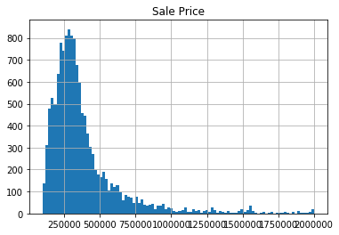
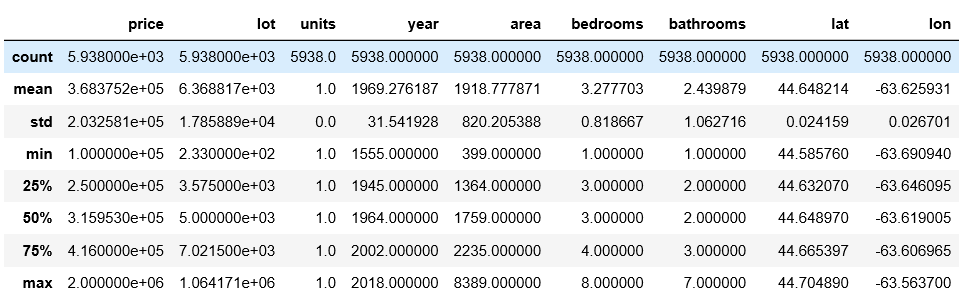
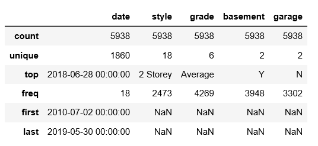
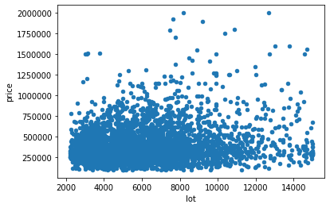
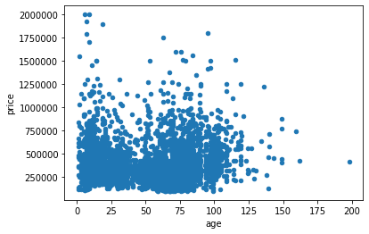
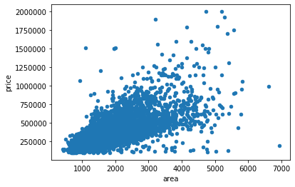
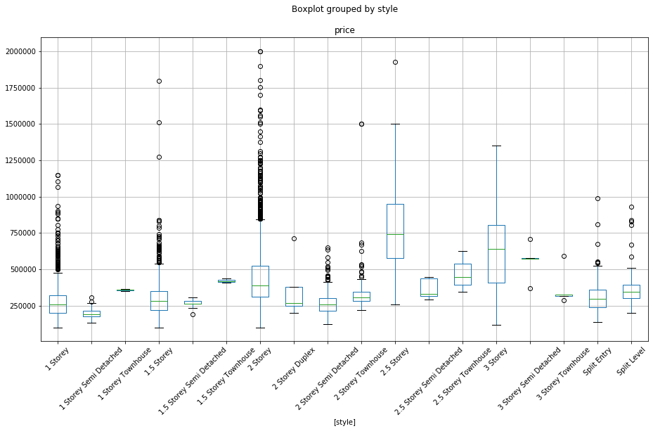

## Use Foursquare Data to Enhance Property Valuation Models

### Introduction

Property valuation models are used to estimate the market value of a property based on its characteristics, sales history and market information. Such models are widely used in different fields. For example, municipal governments use the models to estimate the property tax base, banks and insurance companies use the models to determine the risks associated with mortgage loans, and individual home buyers and sellers or real estate agents use the models to decide on the price they set or offer on a property.

One of the most popular types of property valuation models is the hedonic model, which estimates the market value of a property based on the characteristics of the home and its environment. Typically, the models are specified as a regression model, where the dependent variable is the market value of the home, while the independent variables normally include age, floor area size, lot size, dwelling type (such as single-detached, semi-detached, or apartment), number of floors, bedrooms and bathrooms, etc.

The value of a home is influenced not only by its internal characteristics, but also by characteristics of the neighbourhood it is in. Neighbourhood amenities, such as parks, schools, shopping and dinning, often have a direct impact on house prices. While internal characteristics are often easier to measure and collect, data on the external amenities are much difficult to gather. The lacking of such data often leads to less-than-optimal property valuation models.

### Data

For this project, I will utilize property sales and characteristics data, published by the Province of Nova Scotia, Canada as open data, to create a base hedonic model. Neighbourhood amenities, retrieved using the Foursquare API, are then added to the model to assess the impact of adding neighbourhood amenity data on the accuracy of property valuation models.

Property sales and characteristics data from Nova Scotia are provided in three tables: Parcel land sizes, residential dwelling characteristics, and parcel sales history. The parcel land size table contains the lot size of each property measured in acres and square feet. The residential dwelling characteristics table contains information on each property including the year the property was built, square footage (i.e. floor area size), number of storeys, bedrooms and bathrooms, availability of garage and finished basement, and construction quality of the property. The parcel sales history table contains the sales dates and prices of each property. The tables are cross-referenced by the assessment account number, and contain property addresses and map coordinates as well.

Neighbourhood amenities data from Foursquare are retrieved using the Foursquare API, and contain venue name, location, category (for example park or restaurant), description, price and rating. 

For this project, I will select around 900 properties from the Halifax metropolitan area, and for each property, retrieve the nearest amenities from Foursquare. The two datasets are then joined together to produce a final dataset which will be used to create two hedonic models (with and without neighbourhood amenities). Results are then compared to identify the impact of using neighbourhood amenities in the model.

### Methodology

Three datasets were downloaded from the Nova Scotia open data portal: property sales, property characteristics, and lot sizes. As the property sales table contains all sales of a property, only the last sale of each property is used. Histogram of sale prices shows that the dataset contains a lot of outliers and unreliable data (for example sale price of $1). Outliers (prices above the 0.97 quantile and below the 0.03 quantile) are removed, which results in the histogram below.

It appears that the prices follow a log-normal distribution, as shown in the histogram below.

The three tables are then joined together based on the assessment account number. After removing invalid values (for example lot size 0, units that are not 1, bedroom 0, bathroom 0, and latitude 0 values), as well as properties that are listed as 'under construction', and filtering the table to include only sales from the City of Halifax, the result table contains 5938 rows. The tables below shows a summary of values in the table.

In the Halifax dataset, properties have a mean sale price of $368,000, and a median construction year of 1964. A typical house has three bedrooms, two bathrooms, 2 storeys, with a construction grade of average, with a finished basement, and without a garage.

I use scatterplot to explore the relationship between several key variables and property prices. The plot below shows that there is no obvious relationship between lot sizes and prices.

Plot below shows no obvious relationship between property age and price either

However, plot below shows a clear linear relationship between property floor area and price.

I also explored a few categorical variables and their relationships to prices. Property styles show a strong influence on property prices (figure below). The numbers of bedrooms and bathrooms, the existence of garage, and construction grade, also show a strong influence, but the existence of basements or the year of sale has no obvious influence on property prices.

Due to the limitation of the Foursquare API (995 requests per day for sandbox users), I get a random subset of 900 properties from the Halifax dataset to retrieve the number of venues (or amenities) close to each property. As this is the dataset to be used for modelling, I used RFE (i.e. Recursive Feather Elimination) method from scikit-learn to find the best set of predictors for our target variable. Results show that the best predictors are:

* The number of bathrooms
* Construction grade
* Property style
* Existence of garage
* Property floor area

I then used the Foursquare API to get the top venues near each property. After dropping NA values, the final dataset contains 812 properties. I choose to use the simple but most popular machine learning method, the linear regression method, to use on the dataset. The next section will describe the details.

### Results 

I split the dataset into train and test datasets, with the test dataset ontains 200 cases. Then two regressions are calibrated on the train dataset and the metrics from the test dataset is obtained.

For the first regression, only features from the original dataset are used. For the second regression, the number of neighbourhood amenities (i.e. the number of venues obtained from Foursquare) is used to see if property prices are influenced by neighbourhood amenities.

Unfortunately, due to the limited number of amenities retrieved from Foursquare for each property, as shown below, the second regression only shows very minor improvement over the first model (with an increase of less than 0.1%). Nevertheless, the experiment shows the possibility of using Foursquare data in creating property valuation models.

### Discussion

While the result is unsatisfactory, there are several issues that may be at play.

* There may exist outliers in the dataset which prevents the creation of a good linear regression model.
* There are not many venues for the City of Halifax. A similar model for larger cities such as the City of Toronto may reveal the true value of locational data.

### Conclusion

This project shows the procedure of using open property data and foursquare location data to create and improve property valuation models. While the result is not satisfactory, future models, using data from larger cities or cities in the US, may reveal the true power of locational data.

### Acknowledgments

This project uses information licensed under the Open Data & Information Government License – PVSC & Participating Municipalities. This project uses locational data provided by Foursquare.

